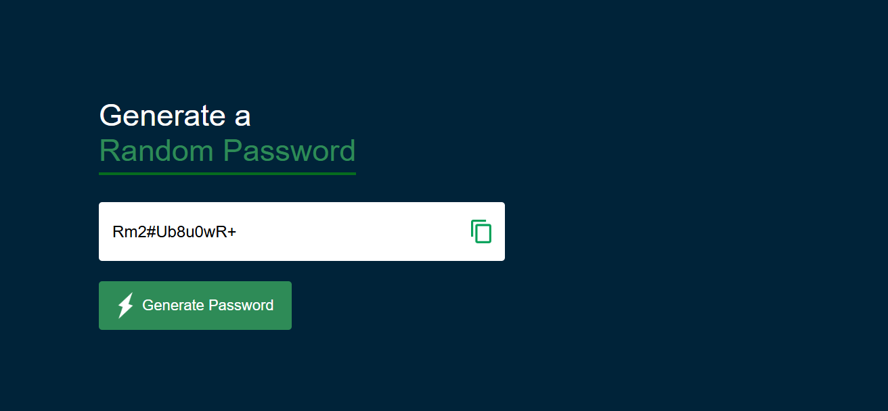

# 🔐 Random Strong Password Generator

A simple, responsive, and user-friendly **Random Strong Password Generator** built using **HTML, CSS, and JavaScript**. This web application generates secure and random passwords instantly to help users create strong passwords for their online accounts.

---

## 📖 Overview

The **Random Strong Password Generator** is designed to generate strong and unpredictable passwords with a single click. It provides an intuitive interface and includes a copy-to-clipboard feature, making it quick and convenient to use.

---

## ✨ Features

- 🔐 Generate strong and secure random passwords
- ⚡ One-click password generation
- 📋 Copy password to clipboard instantly
- 🎨 Clean and modern user interface
- 📱 Fully responsive design
- 🚀 Fast and lightweight
- 💻 Built with pure HTML, CSS, and JavaScript

---

## 🛠️ Technologies Used

- **HTML5**
- **CSS3**
- **JavaScript (ES6)**


## 🚀 Getting Started

### Clone the Repository

```bash
git clone https://github.com/your-username/Random-Strong-Password-Generator.git
```

### Open the Project

Simply open the **index.html** file in your favorite web browser.

---

## 📸 Preview





## 💡 How It Works

1. Open the application.
2. Click the **Generate Password** button.
3. A strong random password will be generated.
4. Click the **Copy** icon/button to copy the password.
5. Paste and use the password wherever needed.

---

## 🔮 Future Improvements

- ✅ Password length slider
- 🔠 Include/Exclude uppercase letters
- 🔡 Include/Exclude lowercase letters
- 🔢 Include numbers
- 🔣 Include special characters
- 🚫 Avoid ambiguous characters
- 📊 Password strength indicator
- 🌙 Dark/Light mode
- ⚙️ User-customizable password options

---

## 🤝 Contributing

Contributions are welcome!

If you have ideas for improvements, feel free to fork this repository, make your changes, and submit a pull request.

---

## 📄 License

This project is licensed under the **MIT License**.

---

## 👨‍💻 Author

**Zain Ul Abidin**

Github: https://github.com/zain-dev-ai-ml/

If you like this project, don't forget to ⭐ star the repository and share your feedback!

---

## 🌟 Show Your Support

Give this project a ⭐ if you found it useful!

